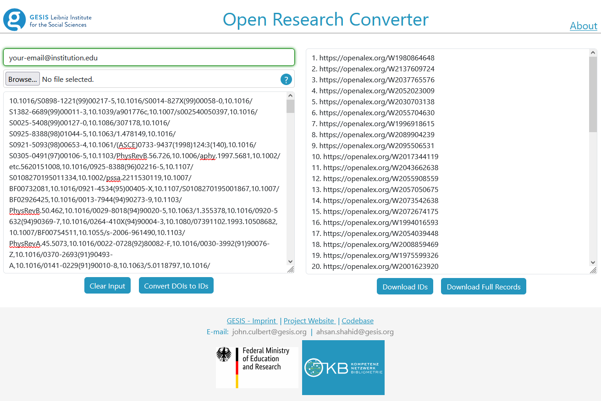

# Summary

The [Open Research Converter (ORC)](https://orc-demo.gesis.org/) is a tool designed to allow researchers, developers and others using bibliographic data to convert their data in bulk to a shareable format utilising [OpenAlex](https://openalex.org/).

# Statement of need

Bibliometrics and in particular Scientometrics suffers from a lack of reproducibility, wherein the databases used to perform bibliometrics are often proprietary and therefore bound by copyright and access agreements which forbid sharing the underlying data used to create the scientific insights shared in papers.

OpenAlex [@priem_openalex_2022], released in 2022, is an open-source bibliometric database compiled by [Our Research](https://ourresearch.org/) which releases its data with a maximally permissive copyright (specifically under the [CC0 1.0 Universal](https://creativecommons.org/publicdomain/zero/1.0/) deed), allowing free sharing of all data. This has allowed bibliometric researchers to download and interrogate the data as they see fit, and enables sharing of data.

However, dealing with OpenAlex data can be cumbersome. The methods of access are currently via the [website](https://openalex.org/), [API](https://api.openalex.org/), or a [data dump](https://docs.openalex.org/download-all-data/openalex-snapshot), each of which have associated challenges for researchers. Namely, use of the website limits the amount of information available to be displayed and may require downloading and then processing the data further to achieve the desired insights, use of the API requires a level of technical knowledge and is rate limited by OpenAlex, and the data dumps are very large (approximately 300GB at time of writing) and also require technical knowledge in the processing and interrogation of the data.

Easing the barrier of access to OpenAlex is a current theme of work in the bibliometrics community. For example, @massimo_2024 have created a tool in the R programming language, [openalexR](https://docs.ropensci.org/openalexR/), capable of bulk collection of OpenAlex data and processing this data from OpenAlex's JSON-based data format to a tabular format. Similarly [OpenAlex Networks](https://github.com/filipinascimento/openalexnet) [@silva_oanet] is a Python library for generation of OpenAlex datasets and processing of citation and coauthorship networks. [OpenAlexNet](https://www.nuget.org/packages/OpenAlexNet) is a C# wrapper for OpenAlex enabling searching of OpenAlex.

Currently OpenAlex has no easy method for researchers to convert their datasets from proprietary formats to OpenAlex. The only options are to manually convert smaller datasets using OpenAlex's website, or download the OpenAlex data dump and process this to enable matching.

We provide here in the Open Research Coverter a tool utilising the OpenAlex API enabling simple bulk conversion of bibliometric data (DOIs) to a shareable format.

# Functionality

The Open Research Converter is a containerised Python- and JavaScript-based tool which, when run, serves a webpage allowing a user to enter either a string of [DOIs](https://www.doi.org/) via copy and paste, or by uploading a correctly formatted CSV file. The user can then convert these to OpenAlex WorkIDs or retrieve the full bibliographic record from OpenAlex.

The tool has been tested on datasets of 100,000 DOIs and was stable. At time of writing, a running version of the ORC can be found at [orc-demo.gesis.org](https://orc-demo.gesis.org/), and the code is released [on GitHub](https://github.com/jhculb/Open-Research-Converter) under a GPL-3.0+ license.

# Research projects

The Open Research Converter has been used in the release of two datasets: @culbert_2024_10997451 which complements @gupta_2024 and @smirnova_2024_10607235 which complements @mir_2024.

# Acknowledgements

This work was funded by the Federal Ministry of Education and Research via funding numbers: 16WIK2301B / 16WIK2301E, The [OpenBib Project](https://bibliometrie.info/en/research/) [@schmidt2025data].
We acknowledge support by Federal Ministry of Education and Research, Germany under grant number 01PQ17001, the Competence Network for Bibliometrics.

Jack Culbert and Philipp Mayr received additional funding by the European Union under the Horizon Europe grant [OMINO – Overcoming Multilevel INformation Overload](https://ominoproject.eu) under grant number 101086321 [@holyst2024].

Our thanks go to [Nina Smirnova](https://orcid.org/0000-0002-3177-3554) for the initial inspiration for this project.

# Contributor Role Taxonomy ([CRediT](https://credit.niso.org/))
**Jack H. Culbert**: Conceptualization (lead); Investigation (lead); Methodology (lead); Software (equal); Visualization (supporting) Writing - Original Draft Preparation (lead); Writing - Review and Editing (equal). **Muhammad Ahsan Shahid**: Software (equal); Visualization (lead); Writing - Review and Editing (equal). **Philipp Mayr**: Project Administration (lead); Supervision (lead); Writing - Review and Editing (equal).

# References
